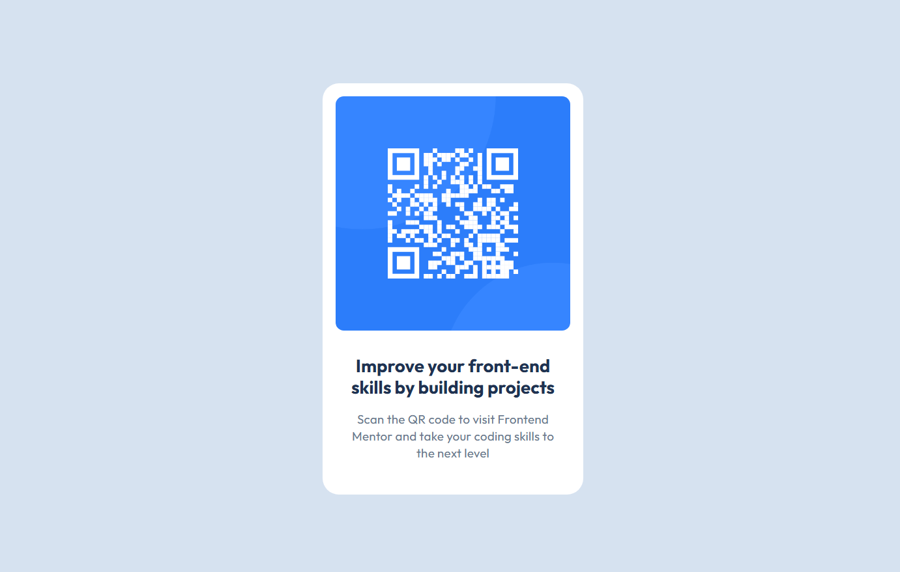

# Frontend Mentor - QR code component solution

This is a solution to the [QR code component challenge on Frontend Mentor](https://www.frontendmentor.io/challenges/qr-code-component-iux_sIO_H). Frontend Mentor challenges help you improve your coding skills by building realistic projects.

## Table of contents

- [Overview](#overview)
  - [Screenshot](#screenshot)
  - [Links](#links)
- [My process](#my-process)
  - [Built with](#built-with)
  - [What I learned](#what-i-learned)
- [Author](#author)

## Overview

### Screenshot

### Links

- Solution URL: [https://github.com/Danny-Agyei/Frontendmentor-qr-code-component](https://github.com/Danny-Agyei/Frontendmentor-qr-code-component)
- Live Site URL: [https://danny-agyei.github.io/Frontendmentor-qr-code-component/](https://danny-agyei.github.io/Frontendmentor-qr-code-component/)

## My process

### Built with

- Semantic HTML5 markup
- CSS custom properties
- Flex-box
- Mobile-first workflow
- BEM methodology

### What I learned

In this project, I learned to use BEM method and be consistent in my layout spacing. I also utilize the flex-box for alignment.

## Author

- Website - [Daniel Agyei](https://github.com/Danny-Agyei)
- Frontend Mentor - [@Danny-Agyei](https://www.frontendmentor.io/profile/Danny-Agyei)
- Twitter - [@DankCodeGenius](https://x.com/DankCodeGenius)
